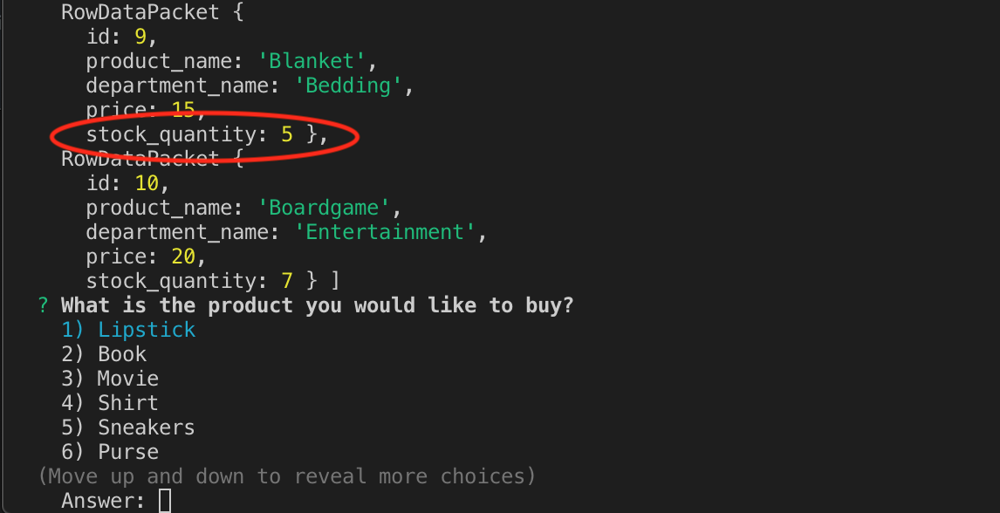
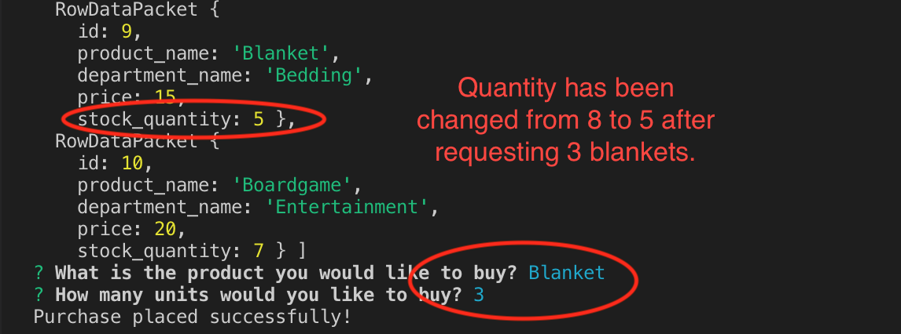
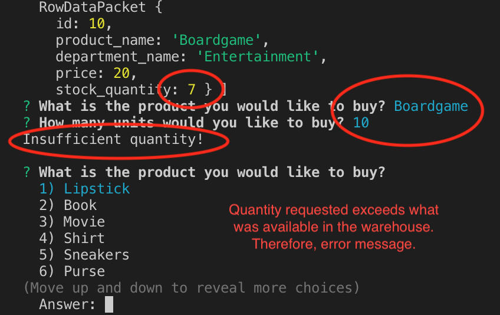

# Node.js-and-MySQL

**Instructions**

* After installing 'mysql' and 'inquirer' modules and running this app in your terminal, an array of objects will appear providing you information on products and their quantities followed by two questions.

* The first question will ask you "What is the product you would like to buy?".

* By using your arrow keys and enter, you will be able to select the product you are interested in purchasing.

* The second question will ask you "How many units would you like to buy?"

* You can then type the number of units you would like to purchase. However, if you request a quantity that exceeds the amount available in the warehouse, you will receive an error message reading "Insufficient quantity!", having the application restart the process again. If your quantity request is less than the quantity that is available in the warehouse, this will trigger a message that says "Purchase placed successfully!" and you will then see the same array of objects with the deduction in quantity from the product you selected.

